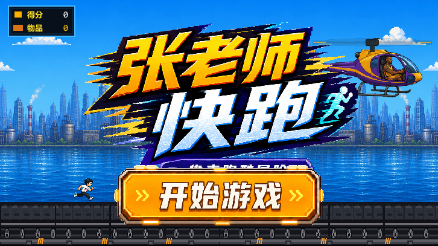
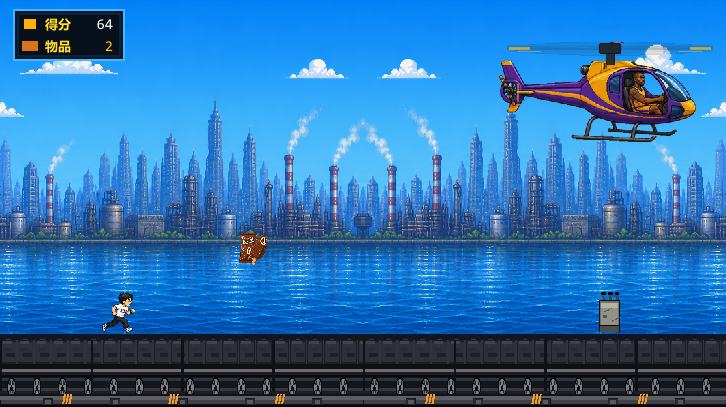
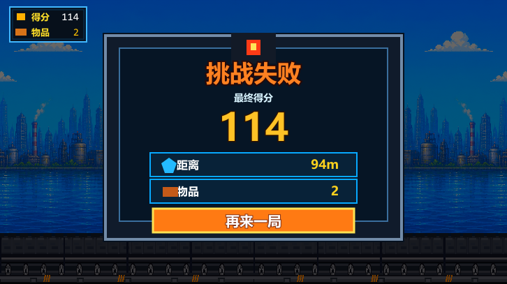
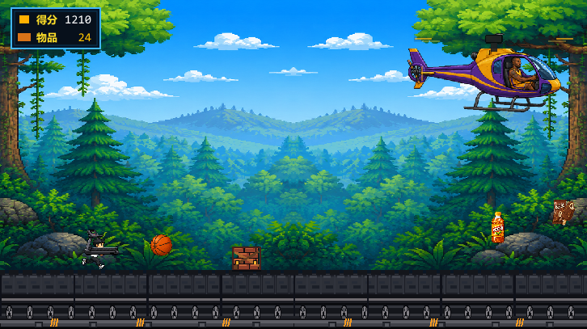
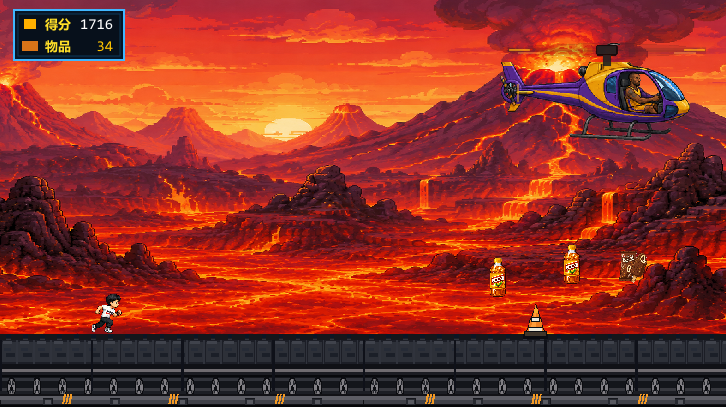

# 张老师快跑

《张老师快跑》是一款使用 Godot 4.6 制作的像素风横版无限跑酷游戏。玩家操控张老师在高速移动的跑步机轨道上不断前进，躲避路障、收集物品、触发特殊道具，并在城市、森林、火山、工业天际线等场景之间穿梭，挑战更远距离和更高分数。

游戏主打轻量、爽快、复古的街机体验：一键开跑，跳跃、二段跳、滑铲躲障碍，直升机在上空追逐并投放特殊道具，赛道速度会随着距离逐步提升。

## 画面预览

从截图可以看到，游戏已经包含完整的开始、游玩、失败结算和多场景跑酷流程。

### 开始菜单



蓝天海港城市背景、跑步机轨道、张老师像素 Logo、醒目的“开始游戏”按钮，以及右侧追逐直升机，形成清晰的第一屏入口。

### 城市赛道



左上角 HUD 实时显示得分和物品数量，角色在跑步机轨道上奔跑，前方会出现收集物和障碍，直升机持续跟随。

### 挑战失败



游戏失败后出现像素仪表盘式结算面板，展示最终得分、奔跑距离、收集物品数量，并提供“再来一局”按钮。

### 森林赛道



背景切换到巨大树木和山林，赛道中出现篮球、砖块、饮料、护盾等道具，视觉层次更丰富。

### 火山赛道



后期场景变为火山熔岩地貌，整体节奏更紧张，障碍和道具密度更高，强调无限跑酷的持续挑战感。

## 核心特色

- 像素风横版跑酷：固定 800x450 视口，适合桌面端和 Web 页面展示。
- 无限挑战机制：距离越远，速度越快，分数持续增长。
- 多背景循环：海港城市、森林、火山、工业城市等背景会随距离推进自动切换。
- 直升机追逐演出：直升机悬停在画面右上方，并会投放特殊道具。
- 道具系统：普通收集物、篮球清屏、跑步机护盾、饮料巨大化等效果已经接入。
- 像素化 UI：开始菜单、HUD、失败结算面板均采用街机像素风设计。
- Web 导出：项目已包含 `web_build/`，可直接部署为网页小游戏。

## 玩法规则

游戏目标很直接：跑得更远，拿到更高分。

分数由两个部分构成：

- 距离分：角色奔跑距离会持续累计。
- 物品分：每收集 1 个物品，额外增加 10 分。

最终得分计算逻辑位于 `scripts/main.gd`：

```gdscript
score = int(distance) + coin_count * 10
```

随着距离增加，赛道速度会逐步提升。速度上限当前为 `650`，基础速度为 `300`。这意味着开局较容易上手，后期需要更快反应。

## 操作方式

| 操作 | 键盘 | 鼠标/触摸 |
| --- | --- | --- |
| 开始游戏 | 空格 / W / 上方向键 | 点击或触摸屏幕 |
| 跳跃 | 空格 / W / 上方向键 | 点击或触摸屏幕 |
| 二段跳 | 空中再次按跳跃键 | 空中再次点击或触摸 |
| 滑铲/下蹲 | S / 下方向键 | 当前主要使用键盘 |
| 失败后重开 | 任意跳跃输入或“再来一局”按钮 | 点击或触摸 |

## 道具说明

| 道具 | 图片资源 | 效果 |
| --- | --- | --- |
| 巧乐兹 | `assets/qiaolezi_item_cutout.png` | 普通收集物，增加物品数和分数。 |
| 雪碧 | `assets/xuebi_item_cutout.png` | 普通收集物，增加物品数和分数。 |
| 篮球 | `assets/basketball_item.png` | 触发投篮动作，发射篮球并短时间清除前方障碍。 |
| 跑步机护盾 | `assets/treadmill_shield_item.png` | 获得 1 次护盾，可抵消一次障碍碰撞。 |
| 冰红茶 | `assets/iced_tea_item.png` | 触发巨大化效果，短时间变大并获得无敌能力，可撞碎障碍。 |

每收集 10 个物品会触发一次里程碑提示，让跑酷过程更有反馈感。

## 障碍说明

游戏当前包含多种障碍，均会从画面右侧生成并向左移动：

| 障碍类型 | 图片资源 | 应对方式 |
| --- | --- | --- |
| 施工锥 | `assets/obstacle_construction_cone.png` | 跳跃或二段跳躲避。 |
| 钢筋混凝土 | `assets/obstacle_concrete_rebar.png` | 提前起跳，避免贴近碰撞。 |
| 砖块堆 | `assets/obstacle_brick_stack.png` | 跳跃通过，也可用篮球或巨大化清除。 |
| 吊钩/高空障碍 | `assets/obstacle_crane_hook.png` | 根据位置选择下蹲、滑铲或跳跃时机。 |

如果玩家在普通状态下碰到障碍，游戏结束；如果处于护盾、巨大化或巨大化结束后的短暂无敌状态，则会抵消碰撞或清除障碍。

## 项目结构

```text
.
├── assets/                 # 角色、道具、障碍、菜单 UI、字体等素材
├── background/             # 城市、森林、火山等背景图
├── scenes/                 # Godot 场景文件
│   ├── main.tscn           # 主游戏场景
│   ├── player.tscn         # 玩家角色场景
│   ├── coin.tscn           # 道具/收集物场景
│   └── obstacle_*.tscn     # 障碍物场景
├── scripts/                # GDScript 游戏逻辑
│   ├── main.gd             # 主循环、生成、得分、UI、音效、背景切换
│   ├── player.gd           # 玩家移动、跳跃、滑铲、动画、碰撞
│   ├── coin_item.gd        # 道具视觉、拾取范围、收集回调
│   ├── obstacle.gd         # 障碍视觉与类型映射
│   └── global.gd           # 全局常量与状态
├── web_build/              # Godot Web 导出产物
├── export_presets.cfg      # Godot 导出配置
├── project.godot           # Godot 项目配置
└── README.md
```

## 本地运行

### 使用 Godot 编辑器运行

1. 安装 Godot 4.6 或兼容版本。
2. 打开 Godot，选择“导入项目”。
3. 选择本项目根目录下的 `project.godot`。
4. 打开项目后运行主场景 `scenes/main.tscn`。

### 运行 Web 导出版本

项目已包含 Web 构建文件，可以在本地启动静态服务器后访问。

```powershell
cd web_build
python -m http.server 8000
```

然后在浏览器打开：

```text
http://localhost:8000
```

如果浏览器直接打开 `web_build/index.html` 无法正常加载，请使用上面的本地服务器方式运行。

## 重新导出 Web 版本

项目中已配置 Web 导出预设，导出目标为：

```text
web_build/index.html
```

在 Godot 中可以通过：

1. 打开项目。
2. 进入“项目 -> 导出”。
3. 选择 `Web` 预设。
4. 点击导出，将文件输出到 `web_build/`。

## 技术实现要点

- 主场景使用 `Node2D` 管理游戏状态，状态包括菜单、游玩中和失败结算。
- 玩家使用 `CharacterBody2D`，支持跳跃、二段跳、滑铲、受伤和胜利动作等 32 帧精灵动画。
- 背景采用多层 Sprite 平铺和淡入淡出切换，实现连续奔跑和场景轮换。
- 跑步机地面使用双贴图循环滚动，增强角色高速奔跑的视觉反馈。
- 障碍和道具按帧数与随机间隔生成，后期节奏随速度提升自然变紧。
- 音效使用 `AudioStreamGenerator` 动态生成，背景音乐使用 `bgm_mario_style.ogg` 循环播放。
- UI 使用 Godot 控件动态绘制像素风面板，并结合图片素材实现开始菜单和失败界面。

## 可继续优化的方向

- 增加排行榜或本地最高分记录。
- 增加移动端专用滑铲按钮。
- 为不同背景配置专属障碍组合。
- 增加暂停菜单、音量设置和新手提示。
- 补充更多实机截图、动图演示或在线试玩地址。

## 版本信息

- 引擎：Godot 4.6
- 分辨率：800x450
- 主场景：`res://scenes/main.tscn`
- 导出平台：Web
